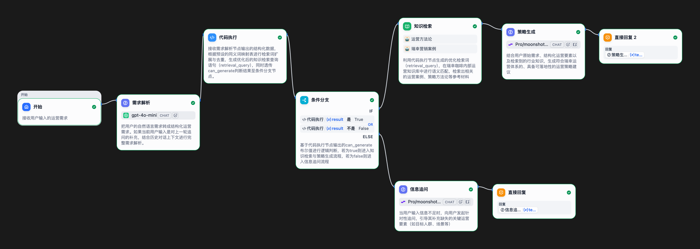

# ai-operator-strategy-agent
## 项目介绍
这是一个基于 Dify 搭建的、面向零售咖啡行业的 AI 运营策略辅助工具。该项目旨在解决传统运营方案制定中过度依赖个人经验、优秀案例难以沉淀复用以及大模型直接输出易产生幻觉和内容空泛等痛点。系统通过构建“需求解析 → 信息追问 → 知识检索（RAG）→ 策略生成”的完整工作流，能够自动理解用户模糊的自然语言需求，结合瑞幸咖啡的历史营销案例与运营方法论，生成结构化、可落地的运营策略建议，从而降低运营门槛，提升方案制定效率与质量。

## Workflow 截图

## 核心能力
1.用户需求解析  
- 能够将用户自然语言运营需求自动拆解为结构化字段，包括：运营目标、目标人群、运营场景、产品品类、触达渠道、时间周期、预算约束
- 降低模糊需求对后续生成质量的影响。

2.运营意图识别
- 能够识别用户当前运营需求所属场景，例如：拉新、促活、新品推广、用户召回、会员运营、品牌曝光等。
- 并基于不同运营目标切换对应的策略生成方向。

3.信息完整性判断  
通过 can_generate 机制判断当前需求是否具备生成条件：
- 核心目标是否明确
- 人群或场景是否缺失
- 是否存在关键上下文不足
避免信息不完整时大模型直接生成空泛或幻觉内容。

4.自动追问  
当需求信息不足时，系统能够自动识别缺失字段，并优先围绕：
- 运营目标
- 用户人群
- 运营场景
通过追问引导用户逐步补全需求，而不是直接生成低质量方案。

5.检索优化  
将用户原始需求改写为适合知识库检索的 Query，包括：结构化字段提取、同义词扩展、检索关键词组合、去噪与长度控制，提升营销案例与运营方法论的召回准确率。

6.RAG 知识增强  
结合运营方法论和瑞幸营销案例，进行知识增强生成（RAG），使输出结果具备：行业语境、运营专业性、案例参考价值，避免大模型泛化输出。

7.AI策略生成  
基于用户需求与知识库内容，生成用户分层建议、活动机制、触达策略、渠道建议、案例参考等内容，帮助运营人员快速形成运营思路与活动草案。

8.输出可控能力  
通过 Prompt Engineering 与流程控制：
- 限制生成长度
- 控制“AI报告感”
- 避免空泛战略表达
- 强化运营语境与可执行性
使输出更贴近真实运营工作流。

## 项目结构说明
- workflow/ → Dify DSL 文件
- prompts/ → Prompt 管理
- docs/ → 设计思考
