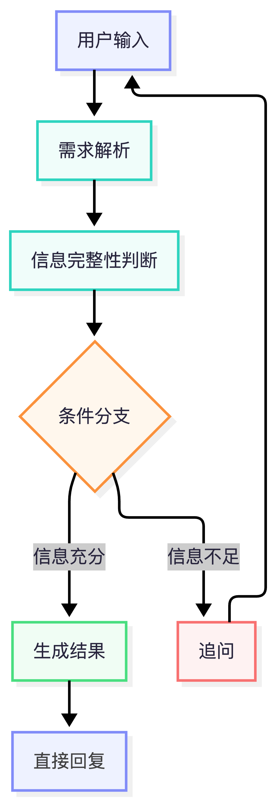

# 设计思考
## 1 项目背景
  本项目基于 Dify Chatflow 搭建，目标是构建一个辅助运营人员快速生成可落地策略的 AI Agent。Workflow 的核心思路是模拟人类专家路径：理解需求 → 检查完整性 → 决策分支 → 执行任务。
  系统需将用户的自然语言转化为结构化运营需求，并根据信息完整度决定是否需要先追问，待信息补齐后生成策略。项目重点不仅在于“生成结果”，更在于验证 LLM 在业务需求理解上的能力，并平衡生成能力与流程稳定性。  
  

## 2 核心设计理念：为何采用“结构化+分支”的 Workflow
传统“输入→输出”线性模式在运营场景中存在风险：
- 信息缺失风险：模糊输入（如“我想搞个活动”）易导致幻觉或泛泛而谈。
- 资源浪费：信息不全时检索和生成，浪费 Token 并产生噪声。
- 逻辑不可控：无法同时处理“需要追问”和“直接生成”两种状态。

为此设计了基于状态机逻辑的 Workflow：
- 先理解：自然语言 → 结构化数据
- 再判断：基于结构化字段判断信息是否完备
- 后执行：若信息不足则追问（补齐信息），待信息完备后进入策略生成
此设计保证了 Agent 的鲁棒性和业务逻辑的严谨性。

## 3 节点职责设计
（1）遵循“单一职责原则”拆解节点：
- 需求解析节点：专注于 NLP，将非结构化文本转化为 JSON，不掺杂业务逻辑。
- 信息追问节点：专注于对话管理，根据缺失字段生成引导语，不负责策略生成。
- 策略生成节点：专注于内容创作，假设信息完备，输出高质量运营方案。

（2）需求解析节点的设计演进
初版曾让同一节点同时完成解析和判断，以减少节点数量。但问题显现：
- LLM 在流程判断上易受 Prompt 和输入模糊性影响，出现误判。
- 节点职责耦合导致 Prompt 复杂度上升，维护成本增加。
因此后续将两者分离：LLM 仅负责解析，判断交由代码节点和条件分支处理。

## 4 流程控制的关键：引入代码执行节点
在 LLM 与业务逻辑之间插入 Python 代码节点，作为“稳定器”：
- 解决 LLM 逻辑判断不稳定性：布尔逻辑判断用代码实现，准确率高，成本为零。
- 数据清洗与预处理：同义词映射、去重、Query Rewrite，确保 RAG 检索质量。
- 结构化数据透传：安全传递字段给后续节点，避免上下文窗口过长导致指令遗忘。

在搭建过程中，针对“如何判断信息是否完备并决定下一步流程”这个问题，设计方向有两种：
- 方案一（纯 LLM 判断）：让需求解析 LLM 节点直接输出一个布尔值（例如 can_generate: true/false），然后 Workflow 的条件分支根据这个值选择“追问”还是“生成”。优点是节点少、流程轻量；缺点是 LLM 同时承担语义理解和逻辑判断，判断稳定性差，且 Prompt 易膨胀。
- 方案二（代码节点判断）：LLM 只负责输出结构化的字段提取结果（不输出判断结果），然后由一个 Python 代码节点对这些字段进行硬性逻辑检查，输出明确的布尔值供条件分支使用。优点是判断准确、成本低、职责清晰；缺点是增加了一个代码节点，流程稍复杂。
  权衡的结果：虽然方案二节点更多，但在稳定性、可维护性上明显优于方案一，因此最终选择了方案二。代码节点的引入正是为了解决 LLM 在逻辑判断上的不稳定性。
  
## 5 关于“信息追问”节点的上下文设计
  初版仅让追问节点读取结构化缺失字段（如“投放渠道”“目标用户”），优点是上下文干净。但问题：模型知道“缺什么”，却不知道“用户原本怎么表达”，导致追问模板化，缺少对原始语义的承接。后续调整为同时读取两部分内容：
- 用户原始提问
- 需求解析节点拆解后的关键信息
即：用户原始输入 + 结构化解析结果 → 信息追问节点。生成的追问更自然，更符合对话连续性。这说明 Workflow 需要在“信息压缩”与“上下文保留”之间找到平衡。

## 6 当前存在的问题与挑战
尽管上述设计在一定程度上提升了系统的稳定性，但目前仍存在一些待优化的问题：
- 结构化输出波动：LLM 输出的 JSON 在部分场景下仍会出现字段缺失或格式不一致的情况，稳定性有待进一步提升。
- Prompt 膨胀与职责边界模糊：随着 Prompt 内容不断增加，不同节点之间的职责边界开始变得模糊，后续需要进一步推进 Prompt 模块化拆分。
  此外，当前工作流仅支持单轮对话：用户一次输入后，系统要么追问、要么生成策略，不会在多轮交互中持续合并上下文。尚未设计多轮对话机制，因此也不存在历史信息合并与状态同步的问题。后续如需支持多轮补充信息，需要重新设计状态管理方案。

经验总结：不要试图用 LLM 解决确定性的逻辑判断问题。让 LLM 做语义理解、提取、生成，让代码做逻辑判断和数据处理。

## 7 设计认知与后续优化方向
（1）设计认知  
  AI Workflow 不是“将所有逻辑交给 LLM”。可长期维护的系统是模型能力、规则与流程控制的协同：
- LLM 作为认知层：自然语言理解、信息抽取、内容生成。
- 代码与条件节点作为控制层：流程约束、状态判断、稳定性保障。
  AI 产品设计的重点是如何围绕模型的不确定性建立稳定的运行机制。

（2）后续优化方向
  基于当前 Workflow 的完成情况，后续可从以下三个方向继续优化：
- 支持多轮对话：当前工作流仅支持单轮交互（一次追问后生成策略）。未来可设计多轮对话机制，允许用户分阶段补充信息，并在多次交互中持续合并上下文，使信息收集更加灵活自然。
- 测试不同模型的生成效果：目前策略生成节点使用的是固定模型。后续可引入多模型对比测试（如不同厂商或不同参数的 LLM），评估其在运营方案质量、风格、实用性等方面的差异，以选择最优模型组合。
- 补充知识库内容：策略生成的依据部分来自 RAG 检索的知识库。后续需持续扩充和优化知识库，包括历史优秀运营案例、行业活动模板、瑞幸内部规范等，提升生成方案的针对性和落地性。

## 8 总结
  本项目是 Dify Chatflow 的实现，也是对 AI Workflow 架构设计的实践探索。通过“解析—判断—分支—生成”架构，模拟了运营人员的流程：确认需求、必要时追问、补齐信息、输出方案。这种模式提升了 AI 在垂直业务场景的落地能力和可用性。
  AI 产品的真正难点不在于模型本身，而在于如何围绕模型建立合理的结构、规则与协同机制。

